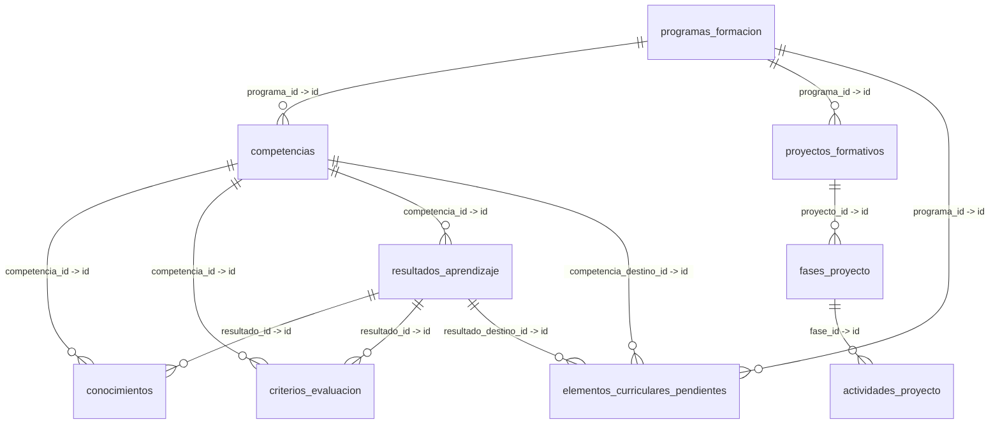

# Informe de la Base de Datos (PostgreSQL) - SENA Guías de Aprendizaje

Este informe detalla las tablas de la base de datos local y sus relaciones, generado a partir de la inspección del esquema de base de datos en PostgreSQL.

## Diagrama de Entidad-Relación (Relaciones Principales)

## Resumen de Tablas
| Tabla | Descripción | Columnas | Relaciones de Salida (FKs) |
|---|---|---|---|
| `actividades_proyecto` | Actividades de proyecto asociadas a una fase | 8 | fase_id -> fases_proyecto |
| `alembic_version` | Historial de migraciones del esquema de base de datos (Alembic) | 1 | Ninguna |
| `borradores_sesion` | Estados persistidos de los wizards de programas y proyectos | 7 | Ninguna |
| `competencias` | Competencias asociadas a un programa de formación | 9 | programa_id -> programas_formacion |
| `conocimientos` | Conocimientos de proceso o saber asociados a una competencia/resultado | 10 | competencia_id -> competencias, resultado_id -> resultados_aprendizaje |
| `criterios_evaluacion` | Criterios de evaluación vinculados a una competencia/resultado | 9 | competencia_id -> competencias, resultado_id -> resultados_aprendizaje |
| `elementos_curriculares_pendientes` | Elementos curriculares importados del Excel pendientes por conciliar | 17 | programa_id -> programas_formacion, competencia_destino_id -> competencias, resultado_destino_id -> resultados_aprendizaje |
| `eventos_auditoria` | Registro de auditoría básica de acciones sobre las entidades | 6 | Ninguna |
| `fases_proyecto` | Fases en las que se divide un proyecto formativo | 7 | proyecto_id -> proyectos_formativos |
| `programas_formacion` | Programa de formación SENA (entidad raíz para el currículo) | 9 | Ninguna |
| `proyectos_formativos` | Proyecto formativo que depende de un programa de formación | 10 | programa_id -> programas_formacion |
| `resultados_aprendizaje` | Resultados de aprendizaje (RAPs) vinculados a una competencia | 9 | competencia_id -> competencias |

## Detalle de Tablas y Columnas

### `actividades_proyecto`
**Descripción**: Actividades de proyecto asociadas a una fase

| Columna | Tipo de Dato | ¿Nulo? | Valor por Defecto |
|---|---|---|---|
| `fase_id` | `uuid` | NO | `NULL` |
| `descripcion` | `text` | NO | `NULL` |
| `orden` | `integer` | SÍ | `NULL` |
| `estado` | `ENUM (estado_campo)` | NO | `NULL` |
| `motivo_fallo_extraccion` | `ENUM (motivo_fallo_extraccion)` | SÍ | `NULL` |
| `id` | `uuid` | NO | `NULL` |
| `fecha_creacion` | `timestamp with time zone` | NO | `now()` |
| `fecha_actualizacion` | `timestamp with time zone` | NO | `now()` |

**Relaciones de Llave Foránea (Foreign Keys)**:
- `fase_id` hace referencia a `fases_proyecto.id` (ON DELETE: CASCADE)

### `alembic_version`
**Descripción**: Historial de migraciones del esquema de base de datos (Alembic)

| Columna | Tipo de Dato | ¿Nulo? | Valor por Defecto |
|---|---|---|---|
| `version_num` | `character varying` | NO | `NULL` |

### `borradores_sesion`
**Descripción**: Estados persistidos de los wizards de programas y proyectos

| Columna | Tipo de Dato | ¿Nulo? | Valor por Defecto |
|---|---|---|---|
| `tipo_bloque` | `character varying` | NO | `NULL` |
| `referencia_id` | `uuid` | NO | `NULL` |
| `paso_actual` | `character varying` | NO | `NULL` |
| `payload_json` | `jsonb` | NO | `NULL` |
| `estado_borrador` | `ENUM (estado_bloque)` | NO | `NULL` |
| `ultima_edicion` | `timestamp with time zone` | NO | `now()` |
| `id` | `uuid` | NO | `NULL` |

### `competencias`
**Descripción**: Competencias asociadas a un programa de formación

| Columna | Tipo de Dato | ¿Nulo? | Valor por Defecto |
|---|---|---|---|
| `programa_id` | `uuid` | NO | `NULL` |
| `codigo_competencia` | `character varying` | NO | `NULL` |
| `nombre_competencia` | `text` | NO | `NULL` |
| `orden` | `integer` | SÍ | `NULL` |
| `estado` | `ENUM (estado_bloque)` | NO | `NULL` |
| `origen_campo` | `ENUM (estado_campo)` | NO | `NULL` |
| `id` | `uuid` | NO | `NULL` |
| `fecha_creacion` | `timestamp with time zone` | NO | `now()` |
| `fecha_actualizacion` | `timestamp with time zone` | NO | `now()` |

**Relaciones de Llave Foránea (Foreign Keys)**:
- `programa_id` hace referencia a `programas_formacion.id` (ON DELETE: CASCADE)

### `conocimientos`
**Descripción**: Conocimientos de proceso o saber asociados a una competencia/resultado

| Columna | Tipo de Dato | ¿Nulo? | Valor por Defecto |
|---|---|---|---|
| `competencia_id` | `uuid` | NO | `NULL` |
| `tipo` | `ENUM (tipo_conocimiento)` | NO | `NULL` |
| `descripcion` | `text` | NO | `NULL` |
| `orden` | `integer` | SÍ | `NULL` |
| `estado` | `ENUM (estado_campo)` | NO | `NULL` |
| `motivo_fallo_extraccion` | `ENUM (motivo_fallo_extraccion)` | SÍ | `NULL` |
| `id` | `uuid` | NO | `NULL` |
| `fecha_creacion` | `timestamp with time zone` | NO | `now()` |
| `fecha_actualizacion` | `timestamp with time zone` | NO | `now()` |
| `resultado_id` | `uuid` | SÍ | `NULL` |

**Relaciones de Llave Foránea (Foreign Keys)**:
- `competencia_id` hace referencia a `competencias.id` (ON DELETE: CASCADE)
- `resultado_id` hace referencia a `resultados_aprendizaje.id` (ON DELETE: CASCADE)

### `criterios_evaluacion`
**Descripción**: Criterios de evaluación vinculados a una competencia/resultado

| Columna | Tipo de Dato | ¿Nulo? | Valor por Defecto |
|---|---|---|---|
| `competencia_id` | `uuid` | NO | `NULL` |
| `descripcion` | `text` | NO | `NULL` |
| `orden` | `integer` | SÍ | `NULL` |
| `estado` | `ENUM (estado_campo)` | NO | `NULL` |
| `motivo_fallo_extraccion` | `ENUM (motivo_fallo_extraccion)` | SÍ | `NULL` |
| `id` | `uuid` | NO | `NULL` |
| `fecha_creacion` | `timestamp with time zone` | NO | `now()` |
| `fecha_actualizacion` | `timestamp with time zone` | NO | `now()` |
| `resultado_id` | `uuid` | SÍ | `NULL` |

**Relaciones de Llave Foránea (Foreign Keys)**:
- `competencia_id` hace referencia a `competencias.id` (ON DELETE: CASCADE)
- `resultado_id` hace referencia a `resultados_aprendizaje.id` (ON DELETE: CASCADE)

### `elementos_curriculares_pendientes`
**Descripción**: Elementos curriculares importados del Excel pendientes por conciliar

| Columna | Tipo de Dato | ¿Nulo? | Valor por Defecto |
|---|---|---|---|
| `id` | `uuid` | NO | `NULL` |
| `referencia_id` | `uuid` | NO | `NULL` |
| `programa_id` | `uuid` | SÍ | `NULL` |
| `tipo_elemento` | `ENUM (tipo_elemento_curricular_pendiente)` | NO | `NULL` |
| `tipo_conocimiento` | `ENUM (tipo_conocimiento)` | SÍ | `NULL` |
| `descripcion` | `text` | NO | `NULL` |
| `competencia_id_origen_excel` | `character varying` | SÍ | `NULL` |
| `rap_id_origen_excel` | `character varying` | SÍ | `NULL` |
| `motivo` | `ENUM (motivo_pendiente_asignacion)` | NO | `NULL` |
| `estado` | `ENUM (estado_conciliacion_pendiente)` | NO | `'PENDIENTE'::estado_conciliacion_pendiente` |
| `competencia_destino_id` | `uuid` | SÍ | `NULL` |
| `resultado_destino_id` | `uuid` | SÍ | `NULL` |
| `elemento_creado_id` | `uuid` | SÍ | `NULL` |
| `orden` | `integer` | SÍ | `NULL` |
| `raw_excel` | `json` | SÍ | `NULL` |
| `fecha_creacion` | `timestamp with time zone` | NO | `now()` |
| `fecha_actualizacion` | `timestamp with time zone` | NO | `now()` |

**Relaciones de Llave Foránea (Foreign Keys)**:
- `programa_id` hace referencia a `programas_formacion.id` (ON DELETE: CASCADE)
- `competencia_destino_id` hace referencia a `competencias.id` (ON DELETE: SET NULL)
- `resultado_destino_id` hace referencia a `resultados_aprendizaje.id` (ON DELETE: SET NULL)

### `eventos_auditoria`
**Descripción**: Registro de auditoría básica de acciones sobre las entidades

| Columna | Tipo de Dato | ¿Nulo? | Valor por Defecto |
|---|---|---|---|
| `entidad` | `character varying` | NO | `NULL` |
| `entidad_id` | `uuid` | NO | `NULL` |
| `accion` | `character varying` | NO | `NULL` |
| `detalle` | `jsonb` | SÍ | `NULL` |
| `fecha_evento` | `timestamp with time zone` | NO | `now()` |
| `id` | `uuid` | NO | `NULL` |

### `fases_proyecto`
**Descripción**: Fases en las que se divide un proyecto formativo

| Columna | Tipo de Dato | ¿Nulo? | Valor por Defecto |
|---|---|---|---|
| `proyecto_id` | `uuid` | NO | `NULL` |
| `nombre_fase` | `character varying` | NO | `NULL` |
| `orden` | `integer` | SÍ | `NULL` |
| `estado` | `ENUM (estado_campo)` | NO | `NULL` |
| `id` | `uuid` | NO | `NULL` |
| `fecha_creacion` | `timestamp with time zone` | NO | `now()` |
| `fecha_actualizacion` | `timestamp with time zone` | NO | `now()` |

**Relaciones de Llave Foránea (Foreign Keys)**:
- `proyecto_id` hace referencia a `proyectos_formativos.id` (ON DELETE: CASCADE)

### `programas_formacion`
**Descripción**: Programa de formación SENA (entidad raíz para el currículo)

| Columna | Tipo de Dato | ¿Nulo? | Valor por Defecto |
|---|---|---|---|
| `codigo_programa` | `character varying` | NO | `NULL` |
| `nombre_programa` | `text` | NO | `NULL` |
| `version_programa` | `character varying` | SÍ | `NULL` |
| `estado` | `ENUM (estado_bloque)` | NO | `NULL` |
| `fuente_cargue` | `ENUM (tipo_fuente_cargue)` | NO | `NULL` |
| `observaciones_revision` | `text` | SÍ | `NULL` |
| `id` | `uuid` | NO | `NULL` |
| `fecha_creacion` | `timestamp with time zone` | NO | `now()` |
| `fecha_actualizacion` | `timestamp with time zone` | NO | `now()` |

### `proyectos_formativos`
**Descripción**: Proyecto formativo que depende de un programa de formación

| Columna | Tipo de Dato | ¿Nulo? | Valor por Defecto |
|---|---|---|---|
| `programa_id` | `uuid` | NO | `NULL` |
| `codigo_proyecto` | `character varying` | NO | `NULL` |
| `nombre_proyecto` | `text` | NO | `NULL` |
| `version_proyecto` | `character varying` | NO | `NULL` |
| `estado` | `ENUM (estado_bloque)` | NO | `NULL` |
| `fuente_cargue` | `ENUM (tipo_fuente_cargue)` | NO | `NULL` |
| `observaciones_revision` | `text` | SÍ | `NULL` |
| `id` | `uuid` | NO | `NULL` |
| `fecha_creacion` | `timestamp with time zone` | NO | `now()` |
| `fecha_actualizacion` | `timestamp with time zone` | NO | `now()` |

**Relaciones de Llave Foránea (Foreign Keys)**:
- `programa_id` hace referencia a `programas_formacion.id` (ON DELETE: CASCADE)

### `resultados_aprendizaje`
**Descripción**: Resultados de aprendizaje (RAPs) vinculados a una competencia

| Columna | Tipo de Dato | ¿Nulo? | Valor por Defecto |
|---|---|---|---|
| `competencia_id` | `uuid` | NO | `NULL` |
| `codigo_resultado` | `character varying` | SÍ | `NULL` |
| `descripcion` | `text` | NO | `NULL` |
| `orden` | `integer` | SÍ | `NULL` |
| `estado` | `ENUM (estado_campo)` | NO | `NULL` |
| `motivo_fallo_extraccion` | `ENUM (motivo_fallo_extraccion)` | SÍ | `NULL` |
| `id` | `uuid` | NO | `NULL` |
| `fecha_creacion` | `timestamp with time zone` | NO | `now()` |
| `fecha_actualizacion` | `timestamp with time zone` | NO | `now()` |

**Relaciones de Llave Foránea (Foreign Keys)**:
- `competencia_id` hace referencia a `competencias.id` (ON DELETE: CASCADE)